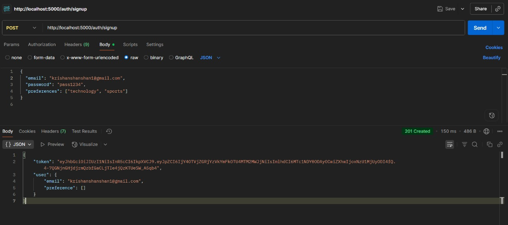
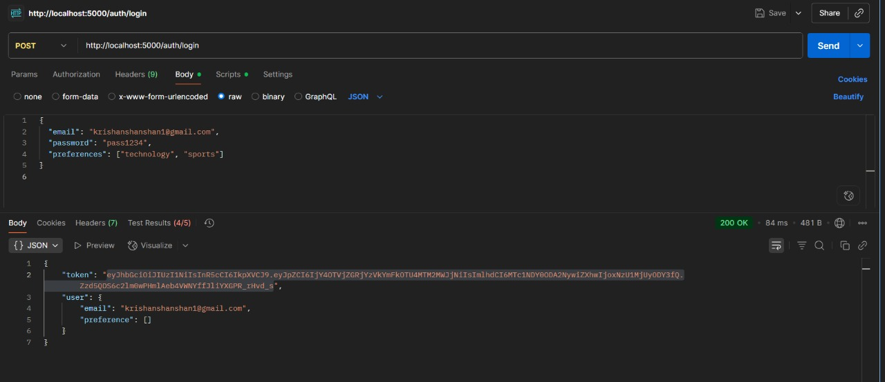

# News Aggregator Backend - Node.js & MongoDB

This is a Node.js backend application for a News Aggregator service that fetches news articles from NewsAPI, stores them in MongoDB, and provides RESTful APIs with JWT authentication. The application also features real-time notifications using WebSockets (Socket.IO) to alert users when new articles matching their preferences are available.

## Features

-   User authentication (signup/login) with JWT
-   News article fetching and storage
-   User preference-based article filtering
-   Favorite articles functionality
-   Real-time notifications via WebSockets
-   Scheduled background jobs for fetching new articles

## Tech Stack

-   **Backend Runtime:** Node.js
-   **API Framework:** Express.js
-   **Database:** MongoDB
-   **ORM:** Mongoose
-   **API Client:** Axios
-   **Environment Variables:** dotenv
-   **JWT:** for authentication 
-   **API Testing:** Postman
-   **socket.IO:** for real time communication
-   **Bcrypt:** for password Hashing 
-   **node-cron:** for schedule task

## Prerequisites
-   **Node.js(LTS version)**
-   **MongoDB (local or Atlas)**
-   **NewsAPI key (free tier)**
-   **Postman/Insomnia for API testing**

## Setup and Installation

Follow these steps to get the project up and running on your local machine.

### 1. Clone the Repository

Clone the project to your local machine.

```bash
git clone https://github.com/kishan-ctrl
cd news-aggregator
```

### 2. Initialize the Project

If you haven't already, initialize the npm project.

```bash
npm init -y
```

### 3. Install Dependencies

Install the required packages for the application to run.

```bash
npm install express mongoose axios dotenv
npm install node-cron
```

### 4. Configure Environment Variables

Create a `.env` file in the root directory with the following variables:

```env
MONGODB_URI=your_mongodb_connection_string
NEWSAPI_KEY=your_newsapi_key
JWT_SECRET=your_jwt_secret_key
PORT=5000 (or your preferred port)
```

### 5. Start the Server

Run the server using 

```bash
node server.js
```

The server will start on the port defined in your `.env` file (e.g., `http://localhost:5000`).

## API Endpoints

The following are the available API endpoints for interacting with the weather data.

---

### `POST /signup`


**Description:** User can Signup with email,password and preference 
**Example URL:** `http://localhost:5000/articles/signup`

**Request Body:**

```json
{
  "email": "user@example.com",
  "password": "password123",
  "preferences": ["technology", "sports"]
}
```

**Success Response (`201 Created`):**

```json
{
  "token": "jwt_token",
  "user": {
    "email": "user@example.com",
    "preferences": ["technology", "sports"]
  }
}
```

---

### `POST /login`


**Description:** user can login with their valid credintials 

**Example URL:** `http://localhost:5000/articles/login`

**Success Response (`200 OK`):**

```json
{
  "email": "user@example.com",
  "password": "password123"
}
```

---

### `GET /articles/`


**Description:** Retrieves all articles from the database.

**Header:** Authorization: Bearer <JWT token>

**Example URL:** `http://localhost:5000/articles`

**Success Response (`200 OK`):**

```json
[
  {
    "_id": "article_id",
    "title": "Article Title",
    "description": "Article description...",
    "url": "https://example.com/article",
    "source": "News Source",
    "category": "technology",
    "publishedAt": "2023-01-01T00:00:00.000Z",
    "favoritedBy": []
  }
]
```

---

### `GET /articles/:id`

**Description:** Get a single article by entering it's id

**Example URL:** `http://localhost:5000/articles/6898638c40fd8c42cfc56721`


**Header:** Authorization : Bearer <JWT token>

**Success Response (`200 OK`):**

```json
{
    "_id": "6898638c40fd8c42cfc56721",
    "title": "A grassroots effort is underway to monitor ICE operations in Southern California - CBS News",
    "description": "Home Depots have become a hotbed​ for immigration raids in recent months, so residents have vowed to remain a constant presence at dozens of locations across Los Angeles County.",
    "url": "https://www.cbsnews.com/news/grassroots-effort-seeks-to-monitor-ice-operations-in-southern-california/",
    "source": "CBS News",
    "publishedAt": "2025-08-09T00:09:03.000Z",
    "favoritedBy": [],
    "__v": 0
}
```


### `POST /articles/:id/favorite`


**Description:** Add a article to favorite list 

**Example URL:** `http://localhost:5000/articles/:id/favorite`

**Header:** Authorization: Bearer <JWT token>

**Success Response (`200 OK`):**

```json
{
    "message": "Article added to favorite "
}
```

---

### `DELETE /articles/:id/favorite`

**Description:** Remove article from favorite list 


**Example URL:** `http://localhost:5000/articles/:id/favorite`

**Header:** Authorization: Bearer <JWT token>

**Success Response (`200 OK`):**

```json
{
    "message": "Article removed from favorites successfully"
}
```

---

### `GET /articles/favorites`

**Description:** Retrive all favorite article from favorite list 


**Example URL:** `http://localhost:5000/articles/favorites`

**Header:** Authorization: Bearer <JWT token>

**Success Response (`200 OK`):**

```json
[
    {
        "_id": "6898638c40fd8c42cfc56724",
        "title": "Trump, Putin meeting set for next week in Alaska - The Washington Post",
        "description": "Trump made no mention of whether Ukrainian President Volodymyr Zelensky would be attending.",
        "url": "https://www.washingtonpost.com/politics/2025/08/08/trump-putin-ukraine-meeting/",
        "source": "The Washington Post",
        "publishedAt": "2025-08-08T23:56:41.000Z",
        "favoritedBy": [],
        "__v": 0
    },
    {
        "_id": "6898638c40fd8c42cfc5670c",
        "title": "William Webster, who led FBI and CIA through crises, dies at 101 - The Washington Post",
        "description": "He was credited with restoring trust to the two sullied agencies after the domestic-spying and Iran-contra scandals of the 1970s and ‘80s.",
        "url": "https://www.washingtonpost.com/obituaries/2025/08/08/william-webster-cia-fbi-director-obituary/",
        "source": "The Washington Post",
        "publishedAt": "2025-08-09T05:50:57.000Z",
        "favoritedBy": [],
        "__v": 0
    }
]
```

---

# Web socket Notifications

The application uses Socket.IO for real-time notifications. When new articles matching a user's preferences are fetched (via the background job), the server emits a `new-article` event to the relevant users.

## Client-Side Connection Example:
```bash
import { io } from 'socket.io-client';

const socket = io('http://localhost:3000', {
  auth: {
    token: 'user_jwt_token'
  }
});

socket.on('new-article', (article) => {
  console.log('New article matching your preferences:', article);
});
```

## Background Jobs

The application runs a scheduled job every hour to:
1. Fetch new articles from NewsAPI
2. Store them in MongoDB
3. Notify users via WebSocket if new articles match their preferences

# project Structure 

```bash
news-aggregator/
├── config/
│   └── db.js                # MongoDB connection
├── models/
│   ├── User.js              # User model
│   └── Article.js           # Article model
├── routes/
│   ├── auth.js              # Authentication routes
│   └── articles.js          # Article routes
├── middleware/
│   └── auth.js              # Authentication middleware
├── jobs/
│   └── fetchNews.js         # Background job for fetching news
├── sockets/
│   └── socket.js            # WebSocket handlers
├── .env                     # Environment variables
├── .gitignore
├── server.js                # Main application file
|── package.json
└── client.html              #to referesent the real time notification  

```


